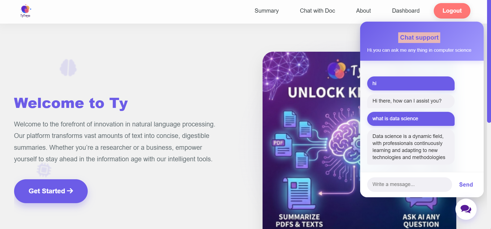
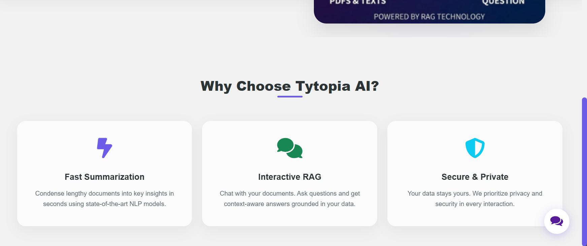
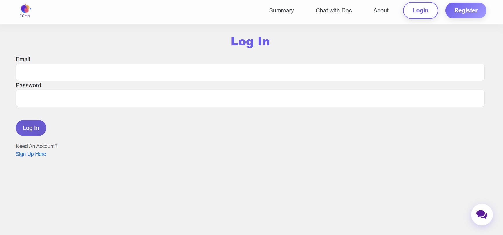
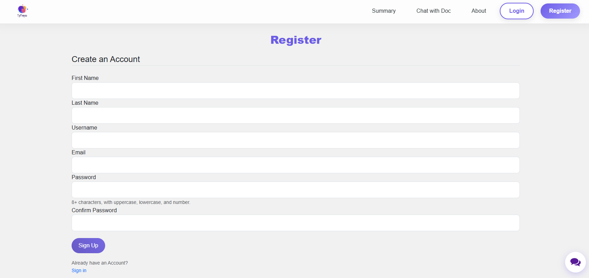
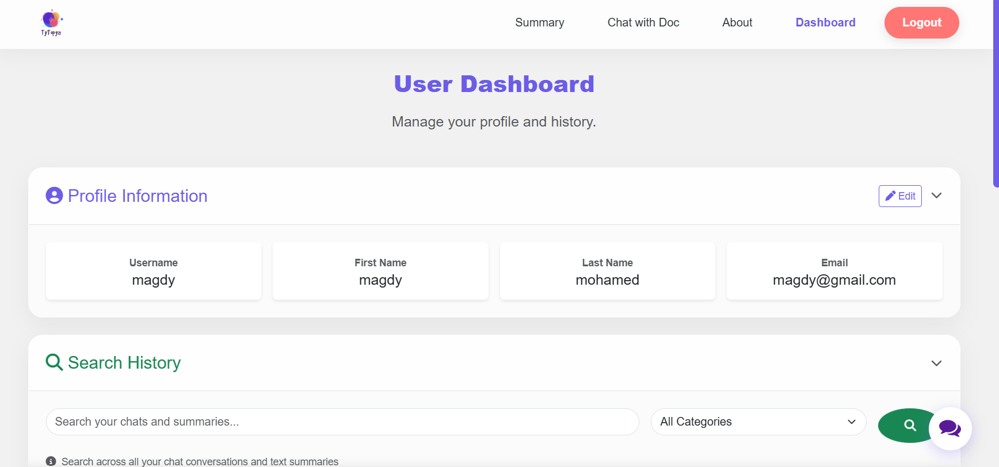
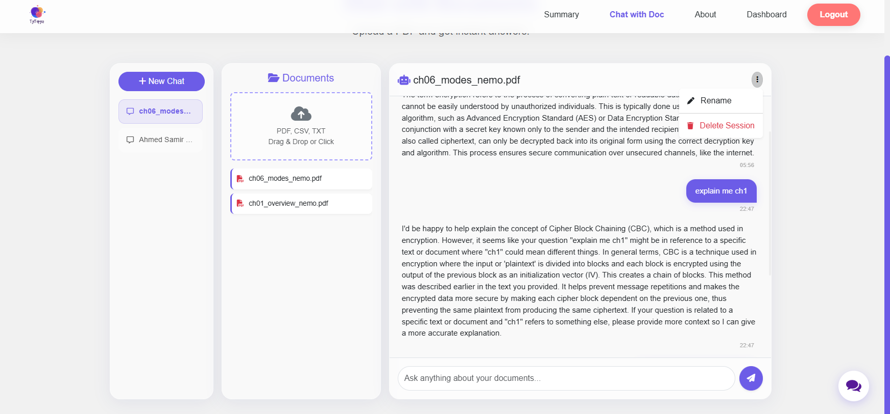
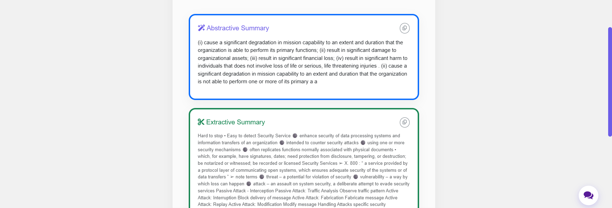
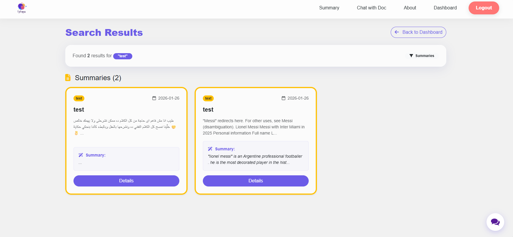
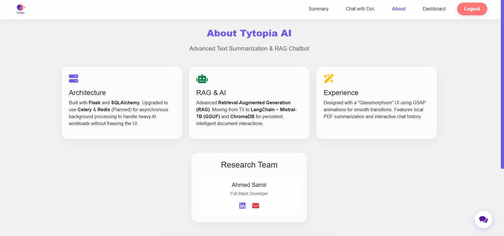
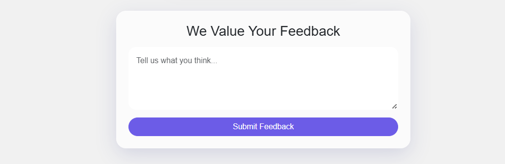

# Tytopia AI 🤖

**A modern, full-stack AI-powered web application** featuring document chat (RAG), text summarization, and an intelligent chatbot - all running locally with open-source models.

[](https://www.python.org/)
[](https://flask.palletsprojects.com/)
[](LICENSE)

## ✨ Features

### 🗂️ Chat with Documents (RAG)
- Upload multiple PDFs, CSVs, or text files per session
- Ask questions and get AI-powered answers based on your documents
- Powered by **Mistral-7B** (GGUF) and **ChromaDB** vector storage
- Multi-session support with conversation history

### 📝 Text Summarization
- **Abstractive summarization** using T5-large (generates new summaries)
- **Extractive summarization** using SpaCy (selects key sentences)
- Supports text input and PDF uploads
- Asynchronous processing with Celery

### 💬 General Chatbot
- Intent-based conversational AI using Keras/TensorFlow
- Trained on custom intents for site navigation and general queries
- Persistent chat history per user

### 🎨 Modern UI/UX
- Glassmorphism design with smooth animations (GSAP)
- Fully responsive Bootstrap 5 interface
- Real-time feedback with SweetAlert2
- Custom purple theme (#6c5ce7)

## 📸 Screenshots

### 🏠 Landing Page



### 🔐 Authentication
<p align="center">
  
  
</p>

### 📊 Dashboard



### 🤖 AI Features
#### Document Chat (RAG)


#### Text Summarization


#### Search Results


#### About Page



## 🏗️ Architecture

```
Tytopia AI
├── Frontend: HTML, CSS (Bootstrap 5), Vanilla JS
├── Backend: Flask + SQLAlchemy
├── Task Queue: Celery + Redis
├── AI Models:
│   ├── Mistral-7B (GGUF) - Document Q&A
│   ├── T5-large - Abstractive Summarization
│   ├── SpaCy - Extractive Summarization
│   ├── Sentence-Transformers - Embeddings
│   └── Keras - Intent Classification
└── Database: SQLite (dev) / PostgreSQL (prod)
```

## 🚀 Quick Start

### Prerequisites
- Python 3.11+
- Redis server
- 8GB+ RAM (for running Mistral-7B on CPU)

### Installation

1. **Clone the repository**
```bash
git clone https://github.com/ahmedsamir45/tytopya.git
cd tytopya
```

2. **Create virtual environment**
```bash
python -m venv TYpackges
# Windows
TYpackges\Scripts\activate
# Linux/Mac
source TYpackges/bin/activate
```

3. **Install dependencies**
```bash
pip install -r requirements.txt
```

4. **Download the Mistral-7B model**
```bash
# Download from HuggingFace
# Place in: webapp/models/mistral-7b-instruct-v0.2.Q4_K_M.gguf
```

5. **Set up the database**
```bash
python
>>> from webapp import db, create_app
>>> app = create_app()
>>> with app.app_context():
...     db.create_all()
>>> exit()
```

6. **Start Redis** (in a separate terminal)
```bash
redis-server
```

7. **Start Celery worker** (in a separate terminal)
```bash
# Windows
run_worker.bat
# Linux/Mac
celery -A celery_worker.celery_app worker --loglevel=info
```

8. **Run the application**
```bash
python app.py
```

9. **Open your browser**
```
http://localhost:5000
```

## 📚 Documentation

- [Backend Libraries](LIBRARIES.md) - Detailed explanation of AI/ML libraries
- [Frontend Libraries](FRONTEND_LIBRARIES.md) - UI framework documentation
- [API Documentation](docs/API.md) - REST API endpoints (coming soon)

## 🛠️ Configuration

Key configuration in `config.py`:
- `SECRET_KEY` - Flask session encryption
- `SQLALCHEMY_DATABASE_URI` - Database connection
- `CELERY_BROKER_URL` - Redis connection for Celery

## 🤝 Contributing

Contributions are welcome! Please feel free to submit a Pull Request.

1. Fork the repository
2. Create your feature branch (`git checkout -b feature/AmazingFeature`)
3. Commit your changes (`git commit -m 'Add some AmazingFeature'`)
4. Push to the branch (`git push origin feature/AmazingFeature`)
5. Open a Pull Request

## 📝 License

This project is licensed under the MIT License - see the [LICENSE](LICENSE) file for details.

## 🙏 Acknowledgments

- [LangChain](https://python.langchain.com/) - RAG framework
- [Mistral AI](https://mistral.ai/) - Mistral-7B model
- [ChromaDB](https://www.trychroma.com/) - Vector database
- [HuggingFace](https://huggingface.co/) - Model hosting and transformers

## 📧 Contact

Ahmed Samir - ahmedsamer6788@gmail.com

Project Link: [https://github.com/ahmedsamir45/tytopya](https://github.com/ahmedsamir45/tytopya)

## ⚠️ Known Issues

- RAG responses are slow on CPU (30-60s) - GPU support coming soon
- Windows requires `--pool=solo` for Celery worker
- ChromaDB requires SQLite 3.35.0+

## 🗺️ Roadmap

- [ ] Implement streaming responses (SSE) for faster perceived performance
- [ ] Add GPU support for Mistral-7B
- [ ] Docker containerization
- [ ] API authentication with JWT
- [ ] Multi-language support
- [ ] Export chat history to PDF
